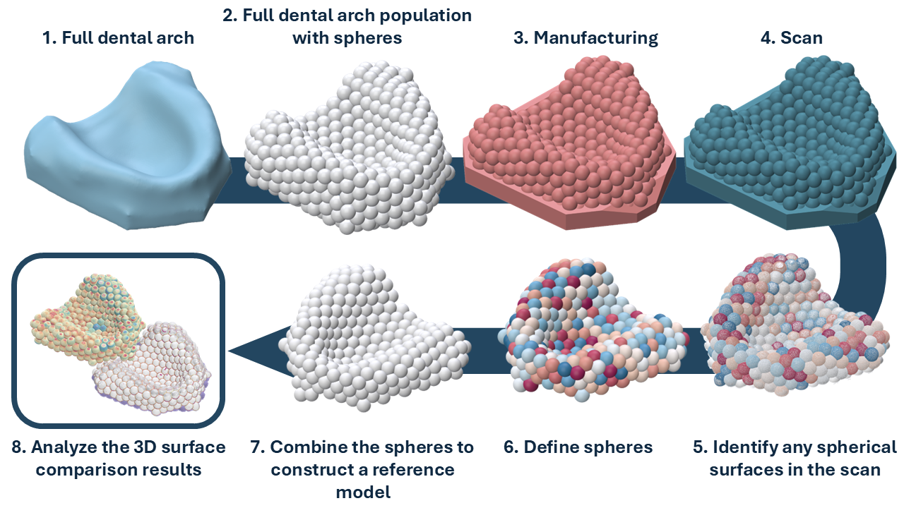

# Full-Arch Dental Model Prototype for Digitization Accuracy Evaluation 

This repository contains files and scripts for an intraoral scanner accuracy estimation method based on a full-arch model prototype, as proposed in the doctoral dissertation:
**Accuracy Evaluation Methods in Digital Dentistry: Focus on Intraoral Scanners and Augmented Reality** by Mykolas Akulauskas.

## Introduction
The main motivation for this method was to develop an approach capable of producing reproducible results when evaluating the digitization accuracy of intraoral scanners for full dental arch surface scans. Two key considerations were addressed:
-    Full-arch dental surfaces are complex and highly variable. This variability reduces the ability to obtain consistent and reproducible accuracy estimates across different intraoral scanner systems. The proposed method suggests replacing anatomically shaped (freeform) dental arches with a model of known dimensions, composed of primitive geometric elements-in our case, **spheres**.
-    Based on this principle, a custom-designed model is manufactured and scanned. Each primitive geometry element serves as an identifiable reference in the scanned model. These elements can be individually recognized and used to reconstruct the reference object, thereby eliminating the need for iterative closest point (ICP) alignment, which has known limitations (see. [O’Toole 2019](https://doi.org/10.1016/j.dental.2019.01.012)).

The workflow is illustrated in the figure below:



## Requirement
For model creation:
- [Rhinoceros 3D (>v.7)](https://www.rhino3d.com/) with Grasshoper
  - Plugin for grasshoper [TT Toolbox](https://www.food4rhino.com/en/app/tt-toolbox)
- Python >3.10
```
pip install -r requirements_v1.txt
```
----
For spherical surface detection:
- Follow instruction for [CloudComPy](https://github.com/CloudCompare/CloudComPy?tab=readme-ov-file) (use  binaries).
- Python 3.11
- Jupyterlab

To install the required dependencies, run the following command:
```
pip install -r requirements_v2.txt
```
## Model creation
Steps 1 and 2 are optional and can be used for creating your own model. A 3D object file (with sphere radius = 2.5 mm) for manufacturing and scanning is already provided at: *Model_creation/Created_model/Model_populated_with_spheres_2.5mm_radius.stl*

Prerequisites:a horseshoe-shaped 3D model (preferably in .stl file format) resembling an edentulous dental arch.

1. In Rhinoceros 3D, open the Grasshopper plugin file located at *Model_creation/Rhinoceros.gh* The instruction steps are numbered within the Grasshopper file. The result will be an .xlsx file containing the centers of the spheres.
2. Open *Model_creation/Rhinoceros_spheres_boolean.ipynb* and run before specifing in the script path where .xlsx file with sphere center coordinates resides. Scripts crates 3D object *Model_populated_with_spheres.stl*.
3. The file *Model_populated_with_spheres.stl* (or the pre-existing model *Model_creation/Created_model/Model_populated_with_spheres_2.5mm_radius.stl*) should then be used for manufacturing and scanning.

## Sphericla surface identification
1. Activate CloudComPy in conda virtual enviroment (use conda terminal)
    ```
    conda activate CloudComPy311
    cd "CloudComPy binary PATH"
    envCloudComPy.bat
    ```
    After successful execution of "envCloudComPy.bat", you should see the following output:
    ```
    Checking environment, Python test: import cloudComPy
    Environment OK!
    ```
2. In the same conda enviroment (CloudComPy311) open 
    ```
    jupyternotebook
    ```
    and access "Model_creation/Procesing_scanned_dental_arch.ipynb"
3. In the script, define the path (Dir_main) where all your Model_populated_with_spheres scans are located. Also, define a second path (Path_to_save) where the script’s results will be saved for each model. After execution, the script outputs the following results:
   - **Scan_radius**: Detected sphere radius;
   - **SD_spheres**: 3D surface deviation for each sphere;
   - **SD_outliers**: Deviation between the newly modeled reference (from step 7 in the workflow) and the scan.

> [!NOTE]
>- This methodology is still in its early stages and should be approached with caution.
>- The model resembles an edentulous arch and should not be used for assessment with dentulous arches.
>- Limitations:
>  - Uncertainties in object manufacturing 
>  - Unknown influences of sphere size. The default sphere radius (2.5 mm) was chosen based on previously used studies ([Pletkus 2024](https://doi.org/10.1111/jopr.13976))
>  - Presence of hard-coded thresholds in the workflow (e.g., the overlapping parameter between spheres in the Grasshopper C# block is set to 0.1 mm)
